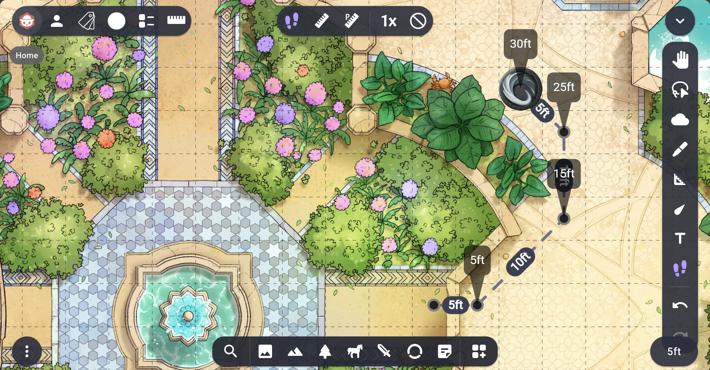

# Drag Tool

Track character movement across multiple drags. Works like a more mobile-friendly version of various 'measure along path' plugins.



### Dragtool

-   Drag items around (mobile friendly) to create 'drag sequences' of multiple waypoints, which keep track of how far the item has moved in total.
-   On square grids, items intelligently snap to the center or corners of grid cells while being dragged depending on their size, to make sure the token bounds adjoin grid lines.
-   Sequences for an item disappear if another player moves the item.
-   Sequences for an item disappear if their owning player leaves.
-   Set the scaling of movement to 2x to simulate 5e difficult terrain, or 0x to simulate teleportation.
-   Double click outside a sequence to quickly delete it.
-   When a lighted object collides with a fog wall, the drag sequence is updated to reflect the collided position after the drag is done.
-   If you also have the [Auras & Emanations](https://github.com/desain/owlbear-emanation/tree/main) plugin installed, when you drag a token with a simple aura, it will trace out the path that they cover while the token is moving.

## Installing

The extension can be installed from https://owlbear-dragtool.pages.dev/manifest.json.

Eventually on [store page](https://extensions.owlbear.rodeo/owlbear-dragtool).

## Development

After checkout, run `pnpm install`.

## How it Works

This project is a simple Typescript app.

The background script `background.ts` communicates with Owlbear Rodeo to create a new tool.

## Building

This project uses [pnpm](https://pnpm.io/) as a package manager.

To install all the dependencies run:

```
pnpm install
```

To run in a development mode run:

```
pnpm dev
```

To make a production build run:

```
pnpm build
```

## To do

-   Key to drop a point at current spot?
-   Allow measure on non token
-   Make 'clear' action only show up when there are active segments
-   Parameter properties
-   Broadcast something when dragging?

## License

GNU GPLv3
